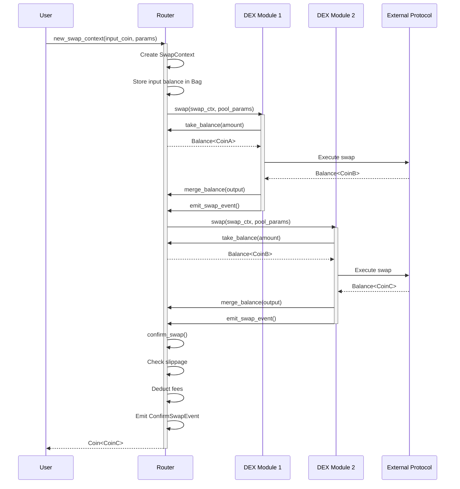
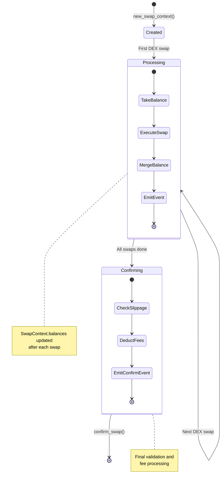
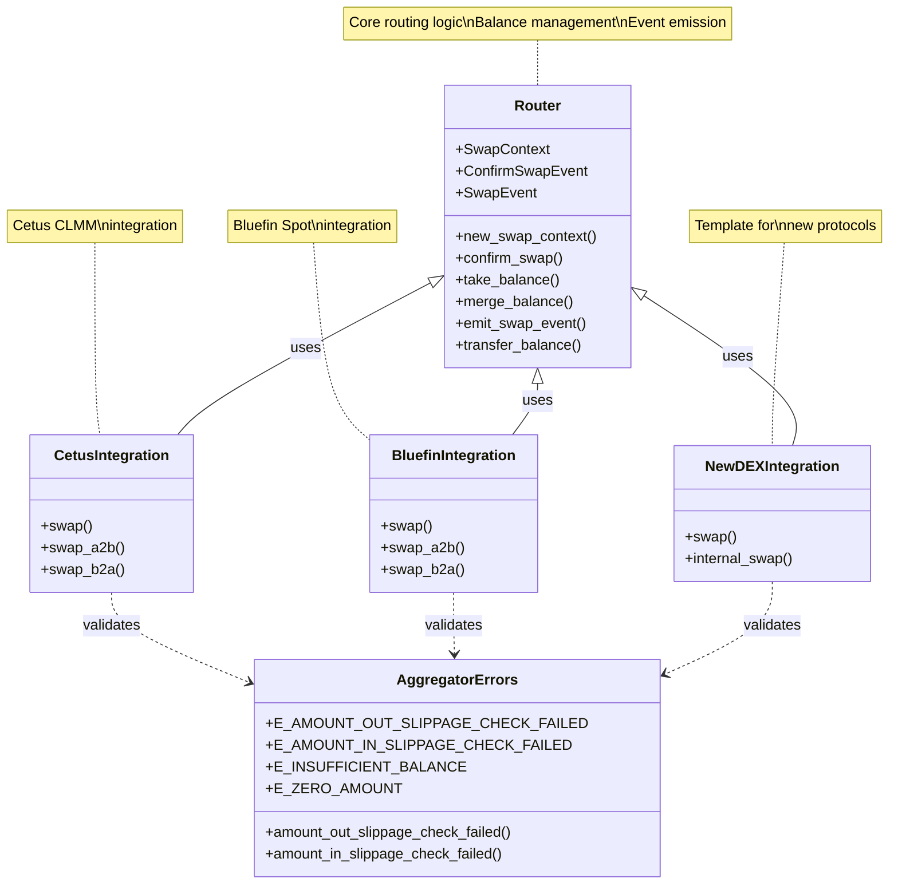
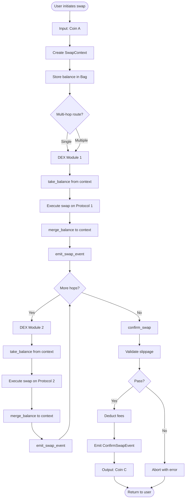

# Aggregator

A high-performance DEX aggregator for the Sui blockchain that finds optimal swap routes across multiple decentralized exchanges.

## Overview

Aggregator is a sophisticated routing system that aggregates liquidity from multiple DEX protocols on Sui to provide users with the best swap rates. The project consists of:

- **Move Smart Contracts**: On-chain swap execution and routing logic
- **TypeScript SDK**: Client library for interacting with the aggregator
- **Multi-DEX Support**: Integration with Cetus, Bluefin, and extensible to other protocols

## Features

- 🔄 **Multi-hop Routing**: Execute complex swap paths across multiple pools
- 💰 **Best Price Discovery**: Automatically finds optimal routes for maximum output
- ⚡ **Gas Optimized**: Efficient on-chain execution with minimal transaction costs
- 🛡️ **Slippage Protection**: Built-in slippage checks and amount limits
- 🔌 **Extensible**: Easy integration of new DEX protocols
- 📊 **Event Tracking**: Comprehensive swap events for analytics

## Architecture

```
aggregator/
├── packages/
│   ├── aggregator/     # Main Move package
│   │   ├── sources/
│   │   │   ├── router.move       # Core routing logic
│   │   │   ├── errors.move       # Error definitions
│   │   │   └── routers/
│   │   │       ├── cetus.move    # Cetus DEX integration
│   │   │       └── bluefin.move  # Bluefin DEX integration
│   │   └── Move.toml
│   └── config/                   # Configuration package
├── src/
│   ├── client.ts                 # Main aggregator client
│   ├── api.ts                    # API communication
│   ├── movecall/                 # Move call builders
│   │   ├── router.ts
│   │   ├── cetus.ts
│   │   └── bluefin.ts
│   └── types/                    # TypeScript types
└── tests/                        # Test suites
```

### Core Contract Flow



### SwapContext State Management



### Adding New DEX Protocol

```mermaid
graph LR
    subgraph "Step 1: Move Contract"
        A1[Create new_dex.move]
        A2[Implement swap function]
        A3[Use router helpers]
        A1 --> A2 --> A3
    end
    
    subgraph "Step 2: TypeScript Client"
        B1[Create NewDexRouter class]
        B2[Implement DexRouter interface]
        B3[Build moveCall]
        B1 --> B2 --> B3
    end
    
    subgraph "Step 3: Integration"
        C1[Register in AggregatorClient]
        C2[Add to Move.toml dependencies]
        C3[Update API parser]
        C1 --> C2 --> C3
    end
    
    subgraph "Step 4: Testing"
        D1[Write unit tests]
        D2[Test integration]
        D3[Deploy and verify]
        D1 --> D2 --> D3
    end
    
    A3 --> B1
    B3 --> C1
    C3 --> D1
```



### Contract Module Structure



### Data Flow Architecture



## Installation

### Prerequisites

- Node.js >= 18
- Bun (recommended) or npm
- Sui CLI >= 1.0.0

### Install Dependencies

```bash
bun install
```

### Build Move Contracts

```bash
cd packages/aggregator
sui move build
```

## Usage

### TypeScript SDK

#### Initialize Client

```typescript
import { AggregatorClient } from './src/client'
import { Env } from './src/config'

const client = new AggregatorClient(
  'https://api-sui.cetus.zone/router_v2',  // API endpoint
  'your-api-key',                          // API key
  Env.Mainnet,                             // Environment
  'your-sui-address'                       // Your address
)
```

#### Find Best Route

```typescript
import { FindRouterParams } from './src/types/shared'

const params: FindRouterParams = {
  from: '0x2::sui::SUI',
  target: '0x5d4b302506645c37ff133b98c4b50a5ae14841659738d6d733d59d0d217a93bf::coin::COIN', // USDC
  amount: '1000000000',  // 1 SUI
  byAmountIn: true,
  providers: ['CETUS', 'BLUEFIN'],
  depth: 3
}

const route = await client.getRouterV3(params)
```

#### Execute Swap

```typescript
import { Transaction } from '@mysten/sui/transactions'

const txb = new Transaction()

// Build swap transaction
const outputCoin = await client.fastRouterSwap({
  router: route,
  slippage: 0.01,  // 1%
  txb,
  partner: 'your-partner-address'  // Optional
})

// Execute transaction
const result = await client.client.signAndExecuteTransaction({
  transaction: txb,
  signer: yourKeypair
})
```

## Move Smart Contracts

### Core Modules

#### `aggregator::router`

Main routing module that manages swap context and execution flow.

**Key Functions:**
- `new_swap_context`: Initialize swap context with parameters
- `confirm_swap`: Finalize swap and return output coin
- `emit_swap_event`: Emit swap events for tracking
- `take_balance`: Extract balance from swap context
- `merge_balance`: Merge balance back to context

**Structs:**
- `SwapContext`: Holds swap state and balances
- `ConfirmSwapEvent`: Emitted on successful swap
- `SwapEvent`: Emitted for each hop in route

#### `aggregator::cetus`

Cetus CLMM integration module.

```move
public fun swap<CoinA, CoinB>(
    swap_ctx: &mut SwapContext,
    global_config: &GlobalConfig,
    pool: &mut Pool<CoinA, CoinB>,
    partner: &Partner,
    a_to_b: bool,
    amount_in: u64,
    clock: &Clock,
    ctx: &mut TxContext
)
```

#### `aggregator::bluefin`

Bluefin Spot integration module.

```move
public fun swap<CoinA, CoinB>(
    swap_ctx: &mut SwapContext,
    config: &GlobalConfig,
    pool: &mut Pool<CoinA, CoinB>,
    a_to_b: bool,
    amount_in: u64,
    clock: &Clock,
    ctx: &mut TxContext
)
```

### Error Codes

Defined in `aggregator::aggregator_errors`:

- `E_AMOUNT_OUT_SLIPPAGE_CHECK_FAILED (1)`: Output amount below minimum
- `E_AMOUNT_IN_SLIPPAGE_CHECK_FAILED (2)`: Input amount exceeds maximum
- `E_INSUFFICIENT_BALANCE (3)`: Insufficient balance for operation
- `E_ZERO_AMOUNT (4)`: Zero amount not allowed

## Development

### Run Tests

```bash
# Run all tests
bun test

# Run specific test suite
bun run dev:cetus

# Watch mode
bun run dev
```

### Test Structure

```typescript
describe('Swap router', () => {
  let fixture: TestFixture
  
  beforeAll(async () => {
    fixture = new TestFixture()
    await fixture.setup()
  })
  
  test('Execute swap', async () => {
    await fixture.testDexRouter(
      'CETUS',
      M_SUI,
      M_USDC,
      '1000000000',
      true
    )
  })
})
```

### Add New DEX Integration

Follow these steps to integrate a new DEX protocol into the aggregator:

#### Step 1: Create Move Contract Module

Create `packages/aggregator/sources/routers/kriya.move`:

```move
module aggregator::kriya {
    use sui::balance;
    use sui::clock::Clock;
    use sui::object;
    
    use kriya_clmm::config::GlobalConfig;
    use kriya_clmm::pool::{Self, Pool};
    
    use aggregator::router::{Self, SwapContext};
    
    /// Constants for price limits
    const MIN_SQRT_PRICE: u128 = 4295048016;
    const MAX_SQRT_PRICE: u128 = 79226673515401279992447579055;
    
    /// Main swap entry point
    public fun swap<CoinA, CoinB>(
        swap_ctx: &mut SwapContext,
        config: &GlobalConfig,
        pool: &mut Pool<CoinA, CoinB>,
        a_to_b: bool,
        amount_in: u64,
        clock: &Clock,
        ctx: &mut TxContext
    ) {
        if (a_to_b) {
            swap_a2b<CoinA, CoinB>(swap_ctx, config, pool, amount_in, clock, ctx);
        } else {
            swap_b2a<CoinA, CoinB>(swap_ctx, config, pool, amount_in, clock, ctx);
        }
    }
    
    /// Internal swap A to B
    fun swap_a2b<CoinA, CoinB>(
        swap_ctx: &mut SwapContext,
        config: &GlobalConfig,
        pool: &mut Pool<CoinA, CoinB>,
        amount_in: u64,
        clock: &Clock,
        ctx: &mut TxContext
    ) {
        // 1. Take balance from swap context
        let balance_in = router::take_balance<CoinA>(swap_ctx, amount_in);
        let actual_amount_in = balance::value(&balance_in);
        
        // Guard against zero amounts
        if (actual_amount_in == 0) {
            balance::destroy_zero(balance_in);
            return
        };
        
        // 2. Execute DEX-specific swap
        let (balance_a_remaining, balance_b_out) = pool::swap<CoinA, CoinB>(
            clock,
            config,
            pool,
            balance_in,
            balance::zero<CoinB>(),
            true,                    // a2b direction
            true,                    // by_amount_in
            actual_amount_in,        // amount
            0,                       // amount_limit (no limit for output)
            MIN_SQRT_PRICE          // sqrt_price_limit
        );
        
        let remaining_amount = balance::value(&balance_a_remaining);
        let amount_out = balance::value(&balance_b_out);
        
        // 3. Handle remaining balance
        if (amount_in == router::max_amount_in()) {
            // If using max amount, transfer remainder to user
            router::transfer_balance<CoinA>(balance_a_remaining, ctx.sender(), ctx);
        } else {
            // Otherwise merge back to context
            router::merge_balance<CoinA>(swap_ctx, balance_a_remaining);
        };
        
        // 4. Merge output balance to context
        router::merge_balance<CoinB>(swap_ctx, balance_b_out);
        
        // 5. Emit swap event
        router::emit_swap_event<CoinA, CoinB>(
            swap_ctx,
            b"KRIYA",                        // DEX name
            object::id(pool),                // Pool ID
            actual_amount_in - remaining_amount,  // Actual amount used
            amount_out,                      // Amount received
            remaining_amount                 // Amount remaining
        );
    }
    
    /// Internal swap B to A (similar pattern)
    fun swap_b2a<CoinA, CoinB>(
        swap_ctx: &mut SwapContext,
        config: &GlobalConfig,
        pool: &mut Pool<CoinA, CoinB>,
        amount_in: u64,
        clock: &Clock,
        ctx: &mut TxContext
    ) {
        // Same pattern as swap_a2b but with reversed coins
        let balance_in = router::take_balance<CoinB>(swap_ctx, amount_in);
        let actual_amount_in = balance::value(&balance_in);
        
        if (actual_amount_in == 0) {
            balance::destroy_zero(balance_in);
            return
        };
        
        let (balance_a_out, balance_b_remaining) = pool::swap<CoinA, CoinB>(
            clock,
            config,
            pool,
            balance::zero<CoinA>(),
            balance_in,
            false,                   // b2a direction
            true,
            actual_amount_in,
            0,
            MAX_SQRT_PRICE
        );
        
        let remaining_amount = balance::value(&balance_b_remaining);
        let amount_out = balance::value(&balance_a_out);
        
        if (amount_in == router::max_amount_in()) {
            router::transfer_balance<CoinB>(balance_b_remaining, ctx.sender(), ctx);
        } else {
            router::merge_balance<CoinB>(swap_ctx, balance_b_remaining);
        };
        
        router::merge_balance<CoinA>(swap_ctx, balance_a_out);
        
        router::emit_swap_event<CoinB, CoinA>(
            swap_ctx,
            b"KRIYA",
            object::id(pool),
            actual_amount_in - remaining_amount,
            amount_out,
            remaining_amount
        );
    }
}
```

#### Step 2: Update Move.toml Dependencies

Add the new DEX dependency to `packages/aggregator/Move.toml`:

```toml
[dependencies]
Sui = { git = "https://github.com/MystenLabs/sui.git", subdir = "crates/sui-framework/packages/sui-framework", rev = "mainnet" }
CetusClmm = { git = "https://github.com/CetusProtocol/cetus-clmm-interface.git", subdir = "sui/cetus_clmm", rev = "mainnet-v1.52.3", override = true }
bluefin_spot = { git = "https://github.com/fireflyprotocol/bluefin-spot-contracts-public.git", subdir = ".", rev = "main" }
# Add new DEX
KriyaClmm = { git = "https://github.com/KriyaDEX/kriya-clmm.git", subdir = "contracts", rev = "mainnet" }

[addresses]
aggregator = "0x0"
cetus_clmm = "0x1eabed72c53feb3805120a081dc15963c204dc8d091542592abaf7a35689b2fb"
# Add DEX address if needed
kriya_clmm = "0x..." 
```

#### Step 3: Create TypeScript Router Class

Create `src/movecall/kriya.ts`:

```typescript
import {
    Transaction,
    TransactionObjectArgument,
} from "@mysten/sui/transactions"
import { SUI_CLOCK_OBJECT_ID } from "@mysten/sui/utils"
import { DexRouter, Extends } from "./index"
import * as Constants from "../const"
import { Env } from "../config"
import { FlattenedPath } from "../types/shared"

class KriyaRouter implements DexRouter {
    private readonly globalConfig: string

    constructor(env: Env) {
        if (env !== Env.Mainnet) {
            throw new Error("Kriya only supported on mainnet")
        }
        // Set the GlobalConfig object ID for the DEX
        this.globalConfig = "0x..." // Kriya's GlobalConfig address
    }

    swap(
        txb: Transaction,
        flattenedPath: FlattenedPath,
        swapContext: TransactionObjectArgument,
        _extends?: Extends
    ): void {
        const swapData = this.prepareSwapData(flattenedPath)
        this.executeSwapContract(txb, swapData, swapContext)
    }

    private prepareSwapData(flattenedPath: FlattenedPath) {
        if (flattenedPath.path.publishedAt == null) {
            throw new Error("Kriya not set publishedAt")
        }

        const path = flattenedPath.path
        const [coinAType, coinBType] = path.direction
            ? [path.from, path.target]
            : [path.target, path.from]

        // Use MAX_AMOUNT_IN for intermediate tokens on their last usage
        const amountIn = flattenedPath.isLastUseOfIntermediateToken
            ? Constants.AGGREGATOR_CONFIG.MAX_AMOUNT_IN
            : path.amountIn

        return {
            coinAType,
            coinBType,
            direction: path.direction,
            amountIn,
            publishedAt: path.publishedAt!,
            poolId: path.id,
        }
    }

    private executeSwapContract(
        txb: Transaction,
        swapData: {
            coinAType: string
            coinBType: string
            direction: boolean
            amountIn: string
            publishedAt: string
            poolId: string
        },
        swapContext: TransactionObjectArgument
    ): void {
        const args = [
            swapContext,
            txb.object(this.globalConfig),
            txb.object(swapData.poolId),
            txb.pure.bool(swapData.direction),
            txb.pure.u64(swapData.amountIn),
            txb.object(SUI_CLOCK_OBJECT_ID),
        ]

        txb.moveCall({
            target: `${swapData.publishedAt}::kriya::swap`,
            typeArguments: [swapData.coinAType, swapData.coinBType],
            arguments: args,
        })
    }
}

export { KriyaRouter }
```

#### Step 4: Register in AggregatorClient

Update `src/client.ts`:

```typescript
import { KriyaRouter } from "./movecall/kriya"

// Add constant
export const KRIYA = "KRIYA"

export const ALL_DEXES = [
    CETUS,
    BLUEFIN,
    KRIYA,  // Add here
]

// In newDexRouter method:
newDexRouter(
    provider: string,
    pythPriceIDs: Map<string, string>,
    partner?: string
): DexRouter {
    switch (provider) {
        case CETUS:
            return new CetusRouter(this.env, partner)
        case BLUEFIN:
            return new BluefinRouter(this.env)
        case KRIYA:
            return new KriyaRouter(this.env)  // Add here
        default:
            throw new Error(`Unsupported DEX: ${provider}`)
    }
}
```

#### Step 5: Update API Parser

Update `src/api.ts` to handle the new protocol in responses:

```typescript
const allPaths: Path[] = data.routes.flatMap((route: any) =>
    route.path.map((p: any) => {
        let published_at: string;

        switch (p.provider) {
            case "CETUS":
                published_at = "0x721d950e57259cd97d41010887ab502ee7753b0a3deb4b6a80099aad0c833928";
                break;
            case "BLUEFIN":
                published_at = "0x4e7c4ba436f8fd5b3c6bb514880ccd11c5109c83c45b5e037394b94204dbbb80";
                break;
            case "KRIYA":  // Add new case
                published_at = "0x...";  // Your deployed aggregator address
                break;
            default:
                throw new Error(`Provider not supported: ${p.provider}`);
        }

        return { ...p, published_at };
    })
);
```

#### Step 6: Add Tests

Create `tests/aggregator/kriya.test.ts`:

```typescript
import { beforeAll, describe, setDefaultTimeout, test } from 'bun:test';
import { TestFixture } from '../fixture';
import { M_USDC, M_SUI } from '../test_data.test';

setDefaultTimeout(30_000);

describe('Kriya Router', () => {
    let fixture: TestFixture;

    beforeAll(async () => {
        fixture = new TestFixture();
        await fixture.setup();
    })

    describe('Single swap', () => {
        test('SUI -> USDC', async () => {
            await fixture.testDexRouter(
                'KRIYA',
                M_SUI,
                M_USDC,
                '1000000000',
                true
            )
        });
    })
})
```

#### Step 7: Build and Test

```bash
# Build Move contracts
cd packages/aggregator
sui move build

# Run tests
cd ../..
bun test tests/aggregator/kriya.test.ts

# Test integration
bun run dev:cetus
```

#### Integration Checklist

- [ ] Move contract created in `sources/routers/`
- [ ] Dependencies added to `Move.toml`
- [ ] TypeScript router class implements `DexRouter`
- [ ] Router registered in `AggregatorClient`
- [ ] API parser updated
- [ ] Tests written and passing
- [ ] Documentation updated
- [ ] Constants defined (addresses, limits)
- [ ] Error handling implemented
- [ ] Events properly emitted

#### Common Patterns

All DEX integrations should follow this pattern:

1. **Take balance** from `SwapContext` using `router::take_balance`
2. **Execute swap** using the DEX's native protocol
3. **Handle remainders** - transfer to user if max amount, else merge back
4. **Merge output** to context using `router::merge_balance`
5. **Emit event** using `router::emit_swap_event`

This ensures consistency and proper state management across all DEX integrations.

## Configuration

### Environment Variables

```bash
# Sui RPC endpoint
SUI_RPC_URL=https://fullnode.mainnet.sui.io:443

# Aggregator API
CETUS_AGGREGATOR_V3=https://api-sui.cetus.zone/router_v2

# Private key for testing
SUI_PRIVATE_KEY=your-private-key
```

### Move.toml Configuration

```toml
[package]
name = "Aggregator"
version = "0.0.1"

[dependencies]
Sui = { git = "https://github.com/MystenLabs/sui.git", subdir = "crates/sui-framework/packages/sui-framework", rev = "mainnet" }
CetusClmm = { git = "https://github.com/CetusProtocol/cetus-clmm-sui.git", subdir = "sui/clmm", rev = "mainnet" }
bluefin_spot = { git = "https://github.com/blue-fin/bluefin-spot.git", subdir = "contracts/clob_v2", rev = "mainnet" }

[addresses]
aggregator = "0x0"
```

## API Reference

### AggregatorClient Methods

#### `getRouterV3(params: FindRouterParams): Promise<RouterData | null>`
Find optimal swap route.

#### `fastRouterSwap(params: BuildFastRouterSwapParams): Promise<TransactionObjectArgument>`
Build swap transaction without coin preparation.

#### `routerSwap(params: BuildRouterSwapParams): Promise<TransactionObjectArgument>`
Build complete swap transaction with coin handling.

#### `devInspectTransactionBlock(txb: Transaction): Promise<any>`
Simulate transaction execution.

#### `sendTransaction(txb: Transaction, signer: Signer): Promise<any>`
Sign and execute transaction.

### Types

```typescript
interface FindRouterParams {
  from: string
  target: string
  amount: string
  byAmountIn: boolean
  providers?: string[]
  depth?: number
  liquidityChanges?: LiquidityChange[]
}

interface RouterData {
  quoteID: string
  amountIn: BN
  amountOut: BN
  paths: Path[]
  byAmountIn: boolean
  insufficientLiquidity: boolean
  deviationRatio: number
  packages?: Map<string, string>
}

interface Path {
  id: string
  direction: boolean
  provider: string
  from: string
  target: string
  feeRate: number
  amountIn: string
  amountOut: string
  publishedAt?: string
  extendedDetails?: any
}
```

## Supported DEX Protocols

| Protocol | Status | Network |
|----------|--------|---------|
| Cetus CLMM | ✅ Active | Mainnet |
| Bluefin Spot | ✅ Active | Mainnet |
| More coming | 🚧 Planned | - |

## Gas Optimization

The aggregator uses several techniques to minimize gas costs:

- **Batch operations**: Multiple swaps in single transaction
- **Efficient balance management**: Minimal coin splits/merges
- **Direct pool access**: No intermediate wrapper calls
- **Optimized type arguments**: Minimal generic instantiation

## Security

- ✅ Slippage protection on all swaps
- ✅ Balance verification at each step
- ✅ Amount limit checks
- ✅ Zero-amount guards
- ⚠️ **Not audited**: Use at your own risk

## Contributing

Contributions are welcome! Please follow these steps:

1. Fork the repository
2. Create a feature branch
3. Make your changes
4. Add tests
5. Submit a pull request

## License

Apache License 2.0

## Contact

- GitHub: [captainenkay0712/aggregator](https://github.com/captainenkay0712/aggregator)

## Acknowledgments

- [Cetus Protocol](https://cetus.zone) - DEX integration
- [Bluefin](https://bluefin.io) - DEX integration
- [Sui Foundation](https://sui.io) - Blockchain platform
